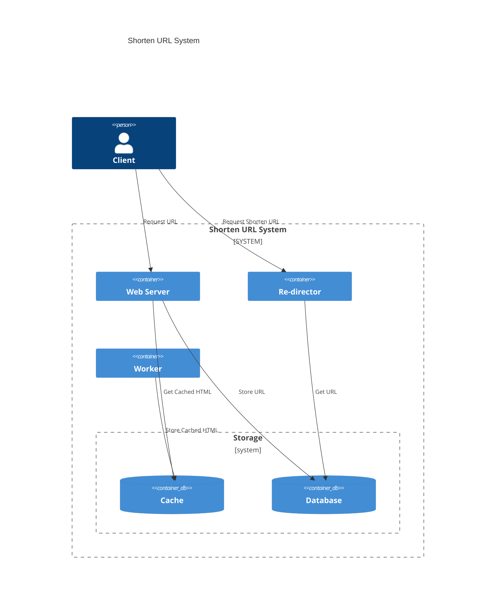

# Compose an Advanced App

## Requirements

To pass this module, you have to implement a shorten url system using the following services.

- A web server that will receive the original url from client and return a shorten url.
  - List of shorten urls and its HTML cached content (Thumbnail).
- A database to store the original and shorten urls.
- A re-director that will receive the shorten url and redirect to the original url with Redirect 301 status code and Location header.
- A cache to store the cached html of the original url to show it in the web server.
- A worker to fetch the original url and store it in the HTML cache, daily job.

## Example Architecture

